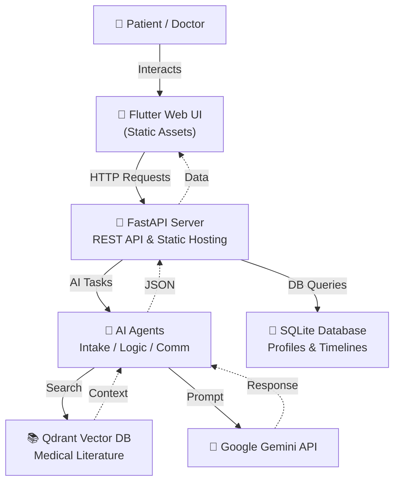
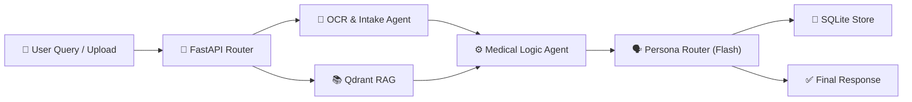

# 🩸 CareMate AI — Thalassemia Care Assistant

<div align="center">


**CareMate AI** is an advanced AI healthcare assistant specializing in Thalassemia management — designed to empower patients with chronic care tracking and assist doctors with clinical insights.

</div>

---

## 🌟 What Is CareMate AI?

CareMate AI combines a **Retrieval-Augmented Generation (RAG)** pipeline with **Google Gemini LLM** to provide:

- 🔍 Intelligent medical research based on up-to-date Thalassemia literature
- 📈 Automated extraction of Hemoglobin & Ferritin levels from uploaded medical reports
- 🧑‍⚕️ Dual-Persona portals tailored specifically for **Patients** and **Doctors**
- 📅 Interactive health timelines and medical records tracking
- 💾 Persistent patient profiles and chat memory

---

## 🚀 Live Demo

| Environment | URL |
|---|---|
| **Production** | [https://huggingface.co/spaces/SeriousSam07/thalassemia-agent](https://huggingface.co/spaces/SeriousSam07/thalassemia-agent) |

---

## 🛠️ Tech Stack

| Layer | Technology |
|---|---|
| **LLM** | Google Gemini (1.5 Flash & Pro) |
| **AI Orchestration** | LangChain & Custom Agents |
| **RAG / Vector DB** | Qdrant (Local Mode) + Gemini Embeddings |
| **Backend** | FastAPI + Uvicorn |
| **Database** | SQLite (User profiles, Timelines, Auth) |
| **Frontend** | Flutter Web (Dart) |
| **Containerization** | Docker (Multi-stage build) |
| **Hosting** | Hugging Face Spaces |

---

## 🏗️ Architecture Overview



### Data Flow Diagram



---

## ✨ Key Features

### 1. 🧑‍⚕️ Dual-Persona Portals
The app intelligently routes the user interface and AI responses based on the logged-in role:
- **Patient Portal:** Simplified medical terms, empathetic AI tone, graphical timeline of health, and automated extraction of lab reports.
- **Doctor Portal:** Deep clinical insights, access to medical literature via RAG, patient search, and professional medical terminology.

### 2. 📚 RAG Pipeline (Medical Knowledge)
- Uses Qdrant to store embeddings of up-to-date Thalassemia medical literature and guidelines.
- The AI securely searches this database before answering clinical queries to avoid hallucinations.

### 3. 📄 Automated Report Analysis
- Upload complete medical reports (PDF/TXT).
- The **Intake Agent** automatically parses the text, extracting critical values like Hemoglobin and Serum Ferritin.

### 4. 📈 Interactive Health Timeline
- A visual timeline dashboard for patients.
- Tracks major events like Blood Transfusions, Chelation Therapy, and Lab Results.

---

## 📁 Project Structure

```text
/
├── Dockerfile                  # Multi-stage container definition
├── README.md                   # This file
├── docker-compose.yml          # Local orchestration
├── backend/
│   ├── main.py                 # FastAPI application
│   ├── models.py               # SQLAlchemy database models
│   ├── schemas.py              # Pydantic validation schemas
│   ├── agent.py                # AI Agent definitions
│   ├── ingest.py               # Script to ingest data to Qdrant
│   ├── upload_analyzer.py      # OCR & Gemini Vision logic
│   └── thal_app.sqlite         # SQLite database
├── frontend/
│   ├── pubspec.yaml            # Flutter dependencies
│   └── lib/
│       ├── main.dart           # App entry point & Routing
│       ├── patient_portal.dart # Patient UI
│       ├── doctor_portal.dart  # Doctor UI
│       └── api_service.dart    # Backend connection logic
└── qdrant_data/                # Local Vector DB storage
```

---

## ⚙️ Environment Variables

The app requires the following secret to function properly.

| Variable | Description |
|---|---|
| GEMINI_API_KEY | Google Gemini API key used for all AI and Embedding tasks. |

> ⚠️ **Note:** On Hugging Face Spaces, this must be set in the Settings > Secrets panel.

---

## 🐳 Running Locally

```bash
# 1. Clone the repo
git clone https://github.com/santo-mantras/Thal-Agent.git
cd Thal-Agent

# 2. Run with Docker Compose
docker-compose up --build

# 3. Open in browser
# http://localhost:8000
```

---

## 📜 License

This project is for educational and research purposes. All medical advice is AI-generated and should be verified by a qualified medical professional before clinical application.
